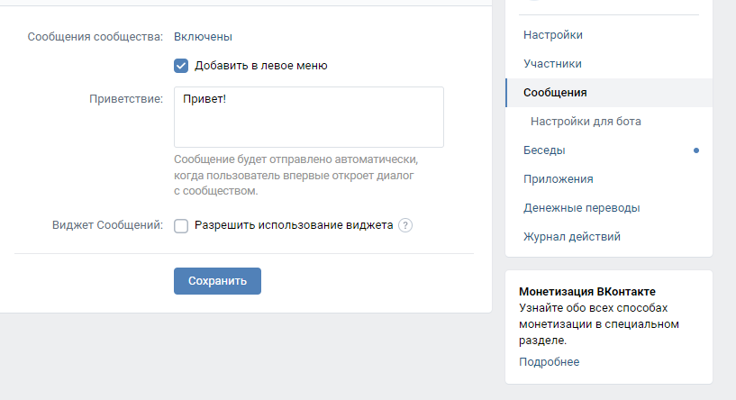

# Quiz-бот в телеграм и vk
Bot for quizzes in [VK](VK.com) and Telegram.
Bot takes question/answer from prepared txt files and randomly sends the question.
It uses a third-party Redis database to store the states and correct answers for users.

## Redis reg
For free registration, use https://redis.com/
And use REDIS_URL, REDIS_PORT, REDIS_PASS from your instance configuration.

## Env
The following environment variables are required:
- TELEGRAM_TOKEN - str, token from [BotFather](https://t.me/botfather)
- VK_TOKEN - str, token for group messages from VK  
- REDIS_URL - str, url from [Redis config](https://app.redislabs.com/#/subscriptions)
- REDIS_PORT - str, port from [Redis config](https://app.redislabs.com/#/subscriptions)
- REDIS_PASS - str, pass from [Redis config](https://app.redislabs.com/#/subscriptions)

## Questions
All quiz questions are stored in `txt` files in the `questions/` folder in format:
```
Вопрос: ...
Ответ: ...
```

## Local start
1. Create `.env` from `.env.Exmaple`
2. `pip install -r requirements.txt`
3. run:
   1. Telegram: `python tg_bot.py`
   2. VK: `python vk_bot.py`

## Heroku start
Create an app on [heroku](https://www.heroku.com/) and add variables in Settings -> Config Vars